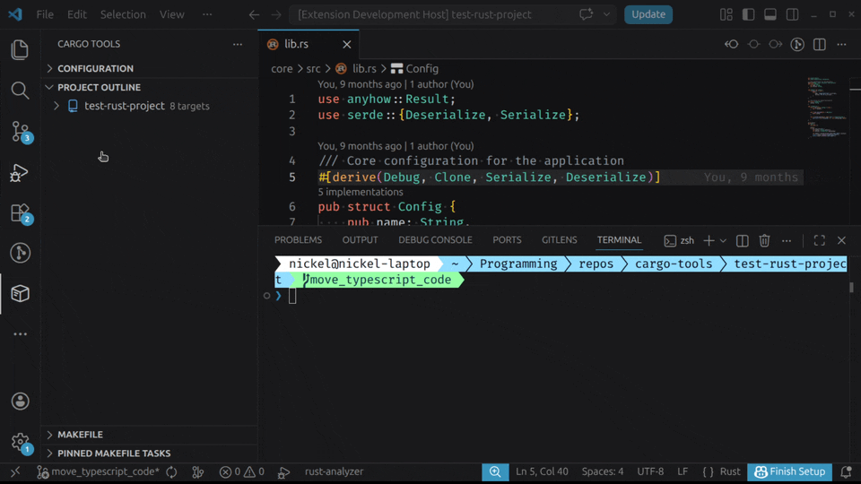

# Cargo Tools

Cargo Tools is a Visual Studio Code extension that provides IDE-like features for Rust/Cargo development. It complements [rust-analyzer](https://marketplace.visualstudio.com/items?itemName=rust-lang.rust-analyzer) by adding project configuration controls, a workspace target browser, and cargo-make task management.

## Features

### Project Configuration

### Project Outline

### cargo-make Integration

## Documentation

- [Online documentation](https://github.com/NickelWenzel/cargo-tools/packages/cargo_tools_vscode/extension/docs/README.md)

## Requirements

- Visual Studio Code 1.102.0 or higher
- Rust toolchain with Cargo installed via [rustup](https://rustup.rs)

## Inspiration

This extension draws inspiration from [vscode-cmake-tools](https://marketplace.visualstudio.com/items?itemName=ms-vscode.cmake-tools).

## License

MIT — see [LICENSE](LICENSE) for details.
